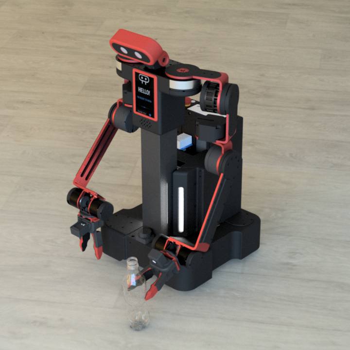
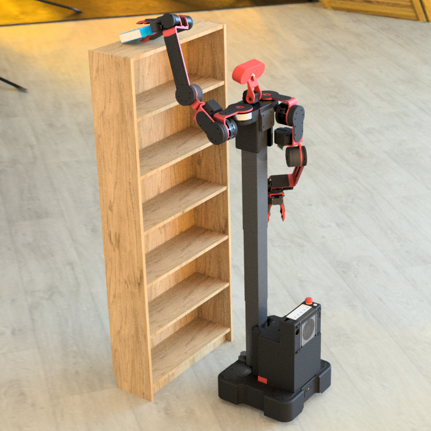
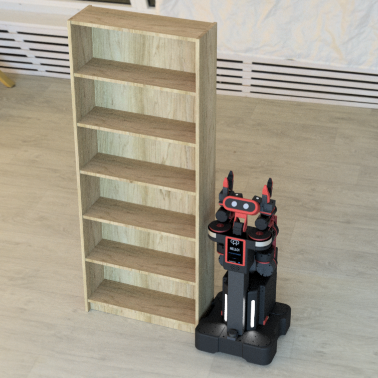
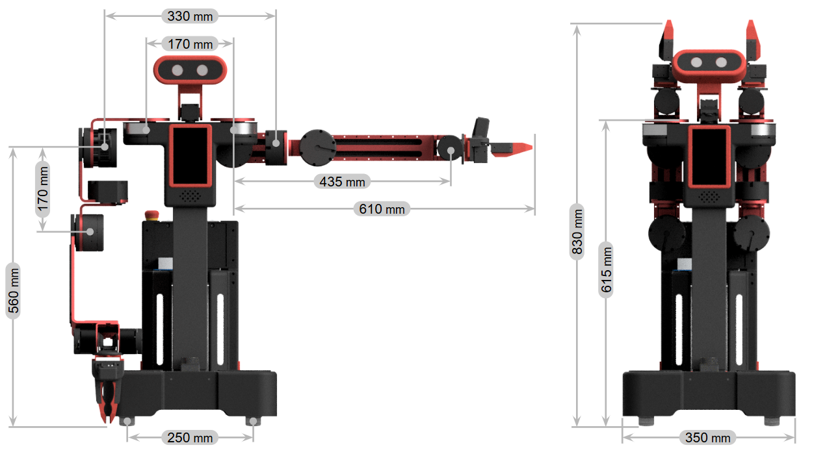
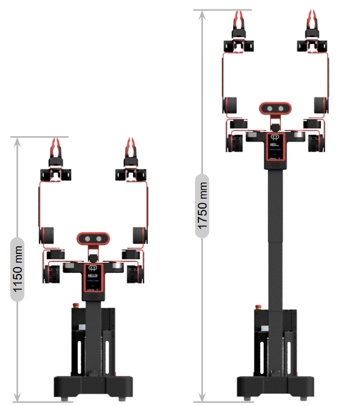
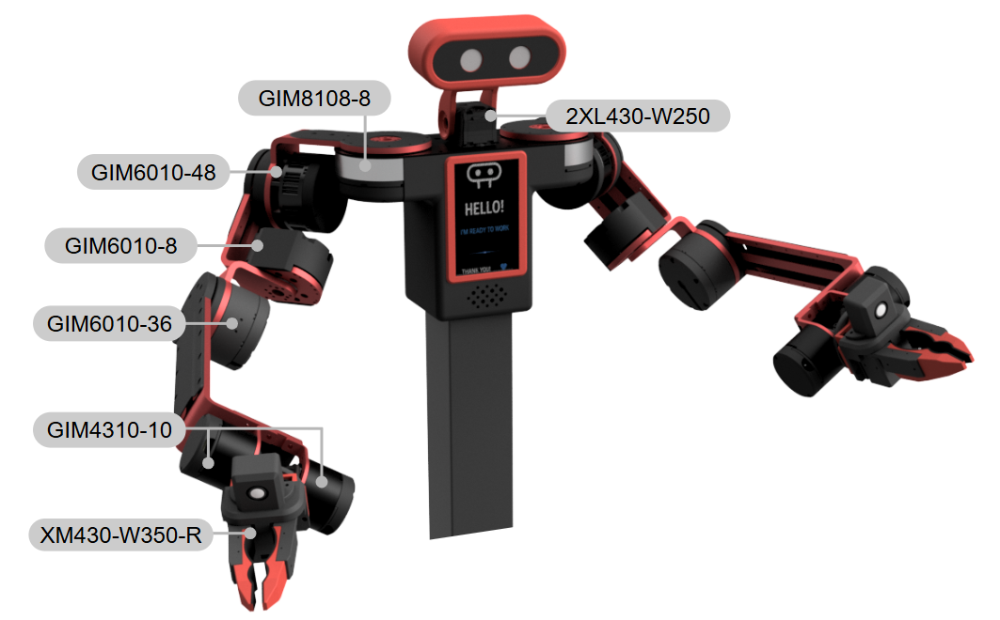

# Near You, Robot
A DIY Semi-Humanoid Robot for Physical AI

<table>
  <tr>
    <td></td>
    <td></td>
    <td></td>
  </tr>
</table>

## Robot Dimensions

<table>
  <tr>
    <td valign="bottom"></td>
    <td valign="bottom"></td>
  </tr>
</table>

## Motor Location

## Detailed Specifications
| **Parameter** | **GIM8108-8 + ODrive Micro** | **GIM6010-48 + ODrive Micro** | **GIM6010-8 + ODrive Micro** | **GIM6010-36 + ODrive Micro** | **GIM4310-10 + ODrive Micro** |
|---|---|---|---|---|---|
| **Rated Voltage** | 24V | 24V | 24V | 24V | 24V |
| **Rated Current** | 3.5A | 3.5A | 3.5A | 3.5A | 3.5A |
| **Peak Current** | 7A | 7A | 7A | 7A | 7A |
| **Rated Torque** | 3.3 Nm | 14.5 Nm | 1.7 Nm | 9 Nm | 2.05 Nm |
| **Peak Torque** | 6.6 Nm | 30 Nm | 3.7 Nm | 25 Nm | 5.6 Nm |
| **Rated Speed** | 196 rpm | 38 rpm | 120 rpm | 33 rpm | 150 rpm 
| **Max No-load Speed** | 308 rpm | 49 rpm | 420 rpm | 50 rpm | 228 rpm |
| **Reduction Ratio** | 8:1 | 48:1 | 8:1 | 36:1 | 10:1 |
| **Number of Pole Pairs** | 21 | 14 | 14 | 14 | 14 |
| **Phase Inductance** | 0.37 mH | 0.34 mH | 0.23 mH | 0.39 mH | 0.75 mH |
| **Phase Resistance** | 0.67 Ω | 0.42 Ω | 0.44 Ω | 0.6 Ω | 1.89 Ω |
| **Outer Diameter** | 92 mm | 80 mm | 80 mm | 76 mm | 53 mm |
| **Height** | 40 mm | 67 mm | 40 mm | 55 mm | 38 mm |
| **Motor Weight** | 396 g | 777 g | 340 g | 574 g | 227 g |
| **Encoder Bits** | 12-bit | 12-bit | 12-bit | 12-bit | 12-bit |
| **No. of Encoders** | 1 | 1 | 1 | 1 | 1 |
| **Encoder Type** | Magnetic encoder (single-turn) | Magnetic encoder (single-turn) | Magnetic encoder (single-turn) | Magnetic encoder (single-turn) | Magnetic encoder (single-turn) |
| **Control Interface** | CAN-FD | CAN-FD | CAN-FD | CAN-FD | CAN-FD |

> [!NOTE]
> The GIM6010-8 currently does not provide enough torque. Need to either use a higher-spec motor driver or change the gear ratio.